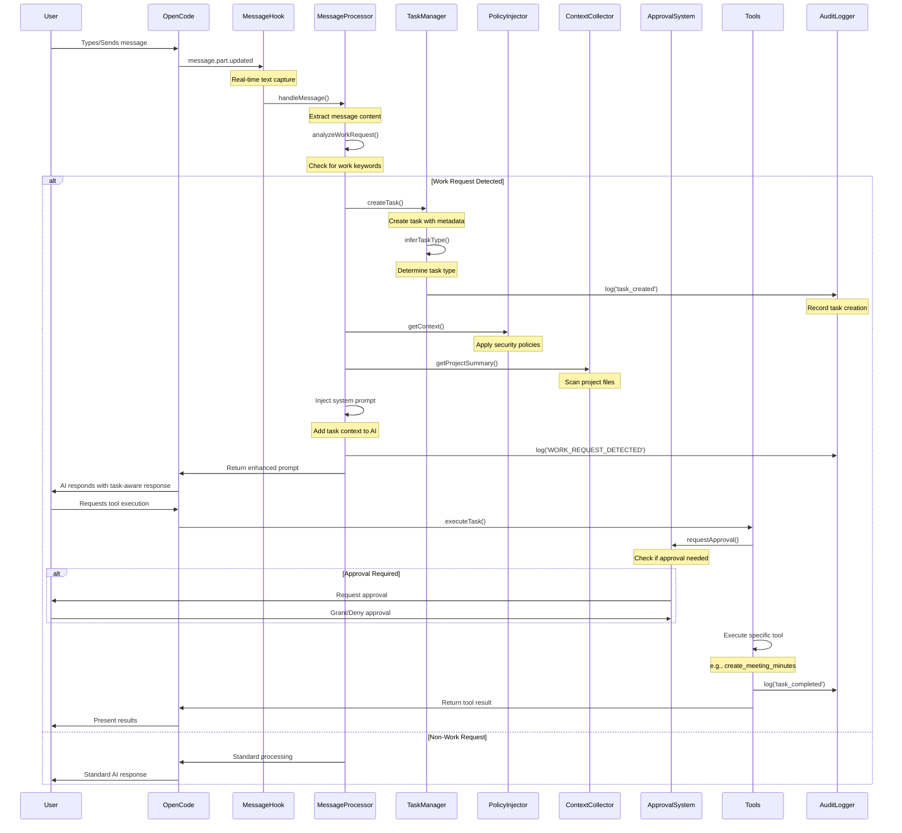
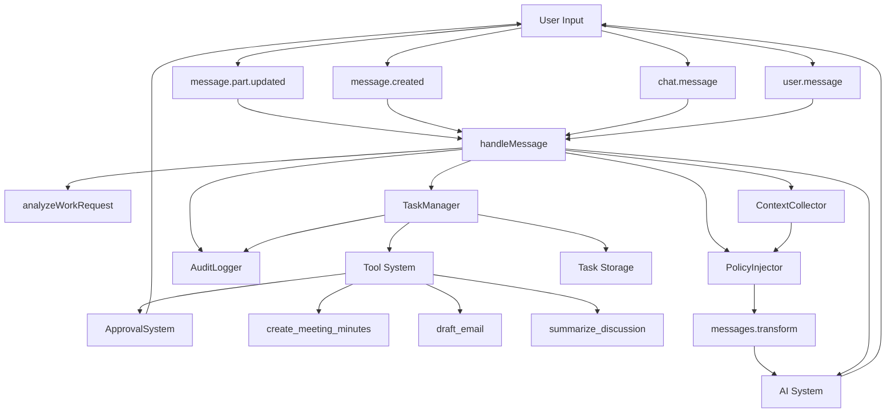
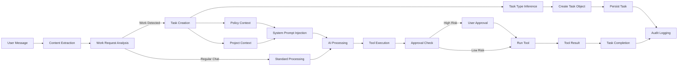
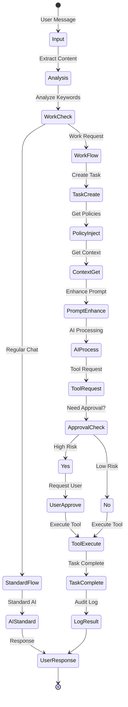
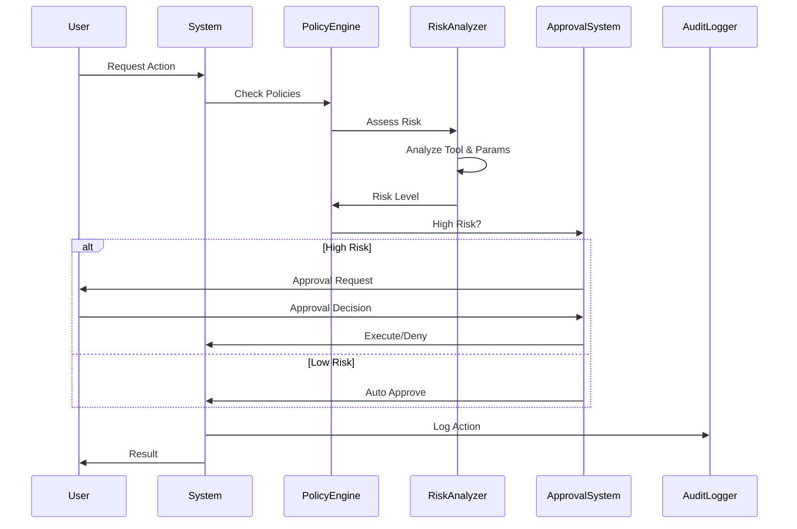
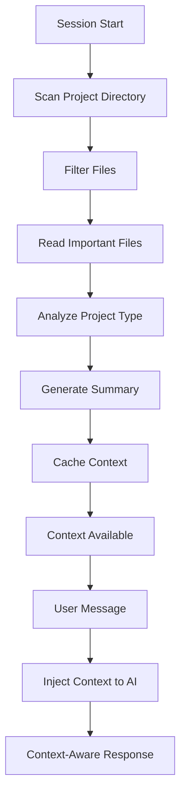
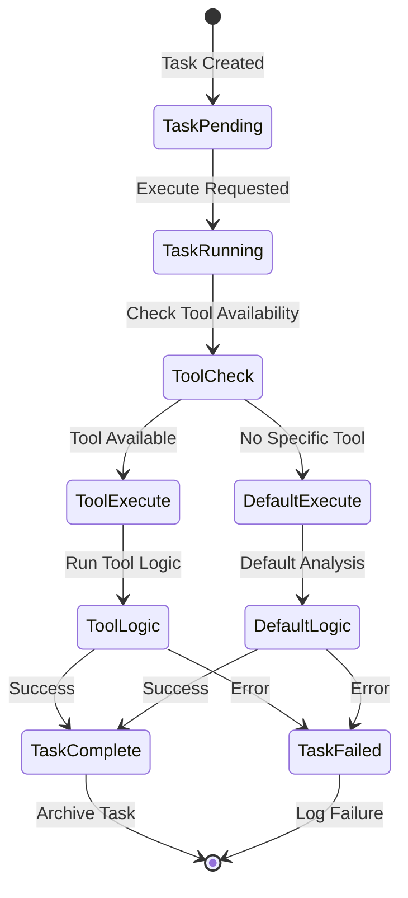
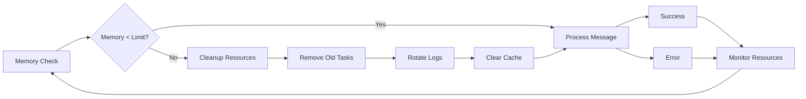
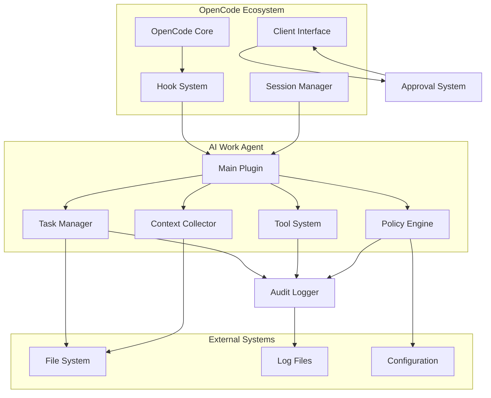

# AI Work Automation Agent - Message Processing Sequence Diagram

## Sequence Flow



## Component Interaction Diagram



## Data Flow Map



## State Transitions



## Error Handling Flow

```mermaid
flowchart TD
    Process[Message Processing] --> Try{Try Execute}
    Try -->|Success| Success[Task Completed]
    Try -->|Error| Catch[Error Caught]
    
    Catch --> LogError[Log Error]
    LogError --> Retry{Can Retry?}
    
    Retry -->|Yes| Wait[Wait and Retry]
    Retry -->|No| Fail[Task Failed]
    
    Wait --> Try
    Success --> AuditLog[Audit Log]
    Fail --> AuditLog
    AuditLog --> UserNotify[Notify User]
    
    UserNotify --> Continue[Continue Processing]
    Continue --> [*]
```

## Security Flow



## Context Collection Flow



## Tool Execution Flow



## Memory and Resource Management



## Integration Points



These diagrams provide a comprehensive visual representation of the message processing flow, component interactions, state transitions, and system architecture for the AI Work Automation Agent.